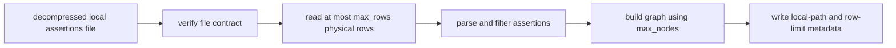

# Implementation Plan: Local Decompressed ConceptNet Inputs and Row Limits

## Scope and outcome

This plan changes only ConceptNet preparation behavior in the active `semmap_haken` package. The implementation will consume an already-downloaded, already-decompressed local assertion file and add a deterministic first-row limit for bounded smoke runs. Dataset download, decompression, and checksum calculation or verification are outside this workflow.

In scope:

- Configuration validation and resolved-config serialization.
- Local input validation and parser invocation for `prepare`.
- Parser row-limit behavior and counters.
- Local-path, input-format, and row-limit provenance in prepared-graph metadata and the run manifest.
- The smoke and small YAML examples, README guidance, and focused tests.
- Repository-local temporary configuration and run-output paths under `./tmp/`.

Out of scope:

- Downloading, caching, decompressing, or otherwise acquiring ConceptNet data.
- Calculating, validating, comparing, or reporting input-file SHA-256 checksums.
- Changing ConceptNet filtering, graph construction, node selection, or `dataset.max_nodes` semantics.
- Changing the schema of downloaded artifacts or adding a new CLI flag.

Current behavior to change:

- [`DatasetConfig`](../src/semmap_haken/config.py:46) accepts a path without file-format validation.
- [`stream_assertions()`](../src/semmap_haken/conceptnet.py:68) accepts gzip based on the filename suffix.
- [`prepare()`](../src/semmap_haken/cli.py:90) includes source-specific checksum enforcement and hashing that are not required for a local-only workflow.
- [`prepare()`](../src/semmap_haken/cli.py:101) records a digest and verification state, but does not persist a row-limit contract.

## Target configuration contract

Extend [`DatasetConfig`](../src/semmap_haken/config.py:46) with `max_rows: int | None = None` and expose it in the resolved configuration.

| Field | Required | Accepted value | Intended behavior |
| --- | --- | --- | --- |
| `dataset.path` | yes for `prepare` | Existing regular decompressed ConceptNet assertion TSV/CSV file | Parsed as UTF-8, tab-delimited, five-field assertions. The filename may end in `.tsv` or `.csv`; its contents remain TSV as defined by ConceptNet assertions. |
| `dataset.max_rows` | no | Positive integer or `null` | Limits parsing to the first N physical assertion rows, before JSON parsing and filtering. `null` means no row limit. |

### Validation rules

1. Keep the existing requirement that [`prepare()`](../src/semmap_haken/cli.py:90) needs `dataset.path`.
2. Resolve the configured path relative to the YAML file as [`load_config()`](../src/semmap_haken/config.py:97) does today.
3. Reject a missing path, directory, non-regular file, unreadable path, or a suffix indicating compression. At minimum reject `.gz`; also reject conventional compressed suffixes such as `.bz2`, `.xz`, and `.zip` with an actionable message explaining that `prepare` expects an already-decompressed assertions file.
4. Do not infer a replacement input, download data, or decompress automatically. The user provides the local decompressed file, for example `../conceptnet-assertions-5.7.0.csv`.
5. Preserve the existing mandatory base fields, relation filtering, `min_weight` validation, and `max_nodes` meaning.
6. Remove `dataset.expected_sha256` from the preparation configuration contract; its value must not be required, parsed, calculated, compared, or emitted as preparation provenance.
7. Validate `max_rows` strictly: accept only an actual integer greater than zero; reject booleans, zero, negatives, floats, numeric strings, and empty values. Omitted or YAML `null` maps to `None`.

## Processing semantics

`max_rows` controls input traversal, not accepted records or graph size.



### N definition

For `dataset.max_rows: N`, process exactly the first `min(N, available_rows)` physical newline-delimited records from the decompressed input, in file order.

- The limit is applied at the top of the parser loop, **before** malformed-row handling, JSON decoding, language/relation/weight filtering, and graph aggregation.
- Blank rows within the prefix count as rows and are handled under the existing invalid-record policy.
- If the file contains fewer than N rows, parse every available row and complete successfully.
- A limited prefix can yield zero accepted assertions; downstream behavior should remain the existing graph-builder behavior rather than silently continuing beyond N.
- `dataset.max_rows` is independent of `dataset.max_nodes`: the former bounds source records read, while the latter bounds URI-sorted nodes after filtering/component selection.
- The row count is not a semantic sample: it is order-sensitive and intended for deterministic local smoke/debug runs. Documentation must state this explicitly.

### Parser API plan

Add a keyword-only `max_rows: int | None = None` parameter to [`stream_assertions()`](../src/semmap_haken/conceptnet.py:68). Keep existing callers source-compatible by defaulting to `None`.

Extend [`ParseReport`](../src/semmap_haken/conceptnet.py:43) so output distinguishes:

- `total_lines`: physical rows actually examined, never greater than `max_rows` when set;
- `accepted` and existing rejection counters;
- configured `max_rows` or `null`;
- a boolean/explicit status indicating whether the input was truncated because an additional row existed.

The implementation must avoid reading and parsing row N+1 merely to calculate the status unless it can do so without changing counting semantics. Prefer a precise, documented field such as `row_limit_reached` meaning that N rows were read, not an assertion that additional rows exist. This preserves streaming and avoids an ambiguous off-by-one counter.

## Local-input provenance

### Runtime behavior

1. `prepare` consumes only the explicitly configured, decompressed local `dataset.path`.
2. Remove the source-specific checksum requirement in [`prepare()`](../src/semmap_haken/cli.py:94), along with input hashing and checksum comparison performed solely for preparation provenance.
3. Do not record a verification status. The path, declared dataset identity/version/source URL when configured, file size if already required by artifact metadata, input-format declaration, and `max_rows` are sufficient operational provenance for this local workflow.

### Manifest and graph-metadata contract

Preserve the resolved local input path and declared dataset identity/version/source URL when configured. Add explicit parsing-bound provenance in both the prepared graph metadata and [`RunManifest`](../src/semmap_haken/manifest.py:17) resumability source identity:

```json
{
  "input_format": "decompressed_conceptnet_assertions_tsv",
  "compression": "none",
  "max_rows": 1000,
  "parser_report": {
    "total_lines": 1000,
    "accepted": 123,
    "row_limit_reached": true
  }
}
```

The actual implementation should use stable field names selected during coding, but must preserve these semantics. The resolved config remains the authoritative declaration; the metadata and manifest must make it possible to determine whether a result came from a prefix and whether integrity comparison was performed without reopening the YAML.

## File-by-file implementation plan

1. Update [`src/semmap_haken/config.py`](../src/semmap_haken/config.py:46).
   - Add `max_rows` to the dataset dataclass.
   - Add strict validation for the optional row limit and remove checksum-specific preparation configuration.
   - Validate a supplied `dataset.path` as an uncompressed local assertions input at config-load time or in a small shared validator invoked by `prepare`; select one location and keep errors deterministic.
   - Include the normalized fields in `ExperimentConfig.resolved`.

2. Update [`src/semmap_haken/conceptnet.py`](../src/semmap_haken/conceptnet.py:43).
   - Make the parser accept decompressed files only for the preparation path; remove or isolate gzip opening so the public parser contract and preparation contract cannot diverge.
   - Implement bounded streaming using `max_rows`, preserving fail-fast and skip-invalid semantics for rows inside the prefix.
   - Extend parse reporting with limit configuration and limit-reached status.

3. Update [`src/semmap_haken/cli.py`](../src/semmap_haken/cli.py:90).
   - Remove the production-only checksum requirement and preparation-time input hashing/comparison.
   - Pass `dataset.max_rows` to the parser.
   - Persist decompression, optional-verification, and row-limit provenance consistently into `graph_metadata.json` and `manifest.json`.

4. Update [`configs/conceptnet_en_smoke.yaml`](../configs/conceptnet_en_smoke.yaml:6) and [`configs/conceptnet_en_small.yaml`](../configs/conceptnet_en_small.yaml:6).
   - Make `dataset.path` documentation state that it must be a decompressed TSV/CSV assertions file.
   - Remove `expected_sha256` and document the local decompressed input path.
   - Add `max_rows` deliberately: use a finite, documented smoke value and `null` for the small/full input example unless the project intentionally wants a bounded small profile.

5. Update [`README.md`](../README.md:25).
   - Remove download, decompression, and checksum-verification instructions from the `prepare` workflow.
   - Document `max_rows` semantics, including its order-sensitive/non-semantic nature.
    - Provide a concise configuration snippet for `../conceptnet-assertions-5.7.0.csv` and a bounded local preparation command.
    - Use the repository-local `./tmp/` directory for temporary test configuration and output rather than the operating-system `/tmp` directory.

6. Add focused tests under [`tests/`](../tests/).
   - Keep fixture data uncompressed; add only minimal generated compressed paths in tests to prove rejection.
   - Preserve existing parser, CLI, artifact, and manifest tests while updating now-invalid expectations.

## Test matrix and acceptance criteria

| Area | Case | Expected result |
| --- | --- | --- |
| Config | Omitted `max_rows` | Resolved value is `null`; parser remains unbounded. |
| Config | `max_rows: 1` | Accepted and serialized as integer one. |
| Config | zero, negative, float, boolean, string | `ConfigurationError` with the field name. |
| Input contract | Existing `.tsv` and `.csv` path | Accepted as a tab-delimited, decompressed assertions file. |
| Input contract | `.gz`, `.bz2`, `.xz`, `.zip` path | Rejected before parsing with decompression guidance. |
| Input contract | Missing path, directory, unreadable/non-regular path | Rejected with actionable path error. |
| Parser | `max_rows: 1` with subsequent valid records | Only first row affects counters and yielded assertions. |
| Parser | Limit crosses invalid/filter-rejected rows | Such rows consume the limit and retain current fail-fast/skip-invalid behavior. |
| Parser | N exceeds file length | All rows parsed, no error, correct report. |
| Parser | `max_rows: null` | Existing unbounded behavior is unchanged. |
| CLI | `prepare` with finite limit | Graph and parser report reflect only prefix rows; resolved config, graph metadata, and manifest agree on the limit. |
| CLI | Compressed configured input | Fails before calling the parser/graph builder and produces no completed run. |
| Regression | Existing fixture full parse and artifact publication | Still passes with `max_rows` omitted and compatible manifest loading. |
| Documentation | Smoke/small configs and README | State that `prepare` uses an already-decompressed local file and does not download, decompress, or verify a checksum. |

Run the focused test modules for configuration, ConceptNet parsing, CLI preparation, and quality/manifest gates, then run the full active test suite. Include actual commands, pass/fail counts, any intentionally skipped tests, and the resulting commit in the implementation results documentation or PR description. Every implementation change must be test-covered; document deviations or unresolved edge cases explicitly.

## Compatibility and risks

- This intentionally breaks `prepare` for gzip inputs that [`stream_assertions()`](../src/semmap_haken/conceptnet.py:74) currently accepts. The README and starter YAML comments must make the migration visible.
- The local-only preparation workflow intentionally does not acquire, decompress, or validate the data file. The user is responsible for placing an already-decompressed file at the configured path.
- Prefix processing affects input-order-dependent graph content. The configured local path, `max_rows`, parser counters, and resolved configuration identify the bounded input contract, but no content-integrity claim is made.
- Do not conflate `max_rows` with node count or use it as an unbiased sampling mechanism.

## Definition of done

The change is complete when [`prepare()`](../src/semmap_haken/cli.py:90) accepts only an existing decompressed local assertions file, does not download, decompress, calculate, or validate input hashes, positive `dataset.max_rows` deterministically bounds physical input rows, and config/metadata/manifest/README/tests all reflect the same contract. Implementation results must be documented and fully test-covered before merge.

## Temporary workspace convention

Use the repository-local [`tmp/`](../tmp/) directory for ad-hoc YAML files and smoke-run artifacts. The starter configurations set `paths.runs_root: tmp/runs`; this resolves to `./tmp/runs` from the repository root. This directory is intentionally ignored by Git and replaces use of the operating-system `/tmp` directory for project-generated temporary data.

## Validation record

The local all-relations smoke configuration was written to the ignored [`tmp/conceptnet_1000_all_relations.yaml`](../tmp/conceptnet_1000_all_relations.yaml) path and executed against the user-provided decompressed ConceptNet file. It declares `dataset.max_rows: 1000`, `dataset.language: ""`, and `dataset.relations: []`.

The resulting prepared artifact was created beneath [`tmp/runs/`](../tmp/runs/) with this observed metadata:

- 1,000 physical rows examined and accepted;
- no language, relation, or weight rejections;
- `row_limit_reached: true`;
- after largest-connected-component selection, 18 nodes and 17 edges;
- selected-edge relation histogram: `Antonym: 17`.

The last two values describe the retained largest connected component rather than all 1,000 accepted assertions. The bounded prefix remains order-sensitive and is not a semantic sample.
