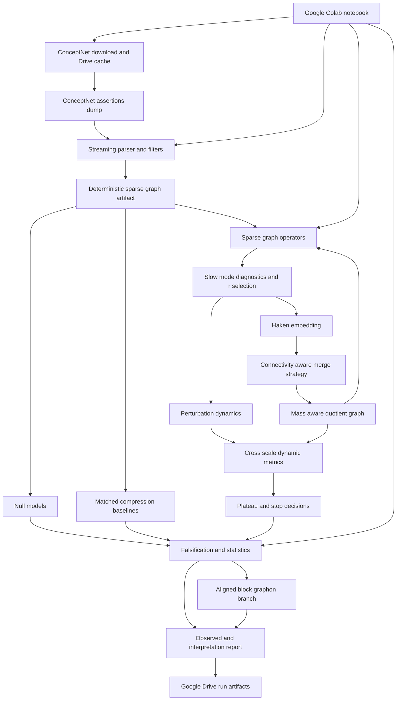
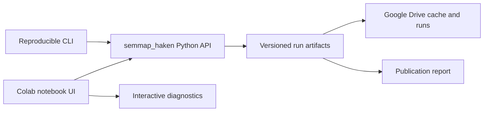
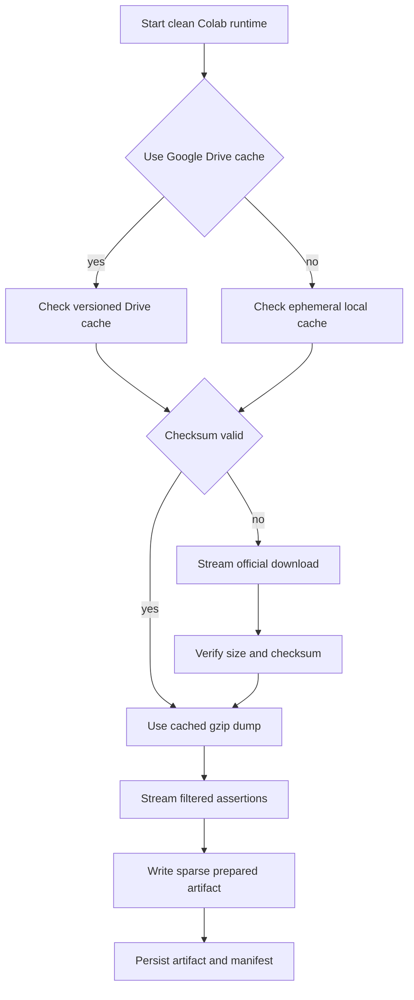

# План развития исследования Haken-Coarsening Graphons for ConceptNet

## 1. Назначение документа

Этот roadmap преобразует текущий прототип `semgraphex` в воспроизводимую исследовательскую систему для проверки гипотез H1–H6 из [постановки исследования](../AGENTS.md). План основан на:

- требованиях и ограничениях из [AGENTS.md](../AGENTS.md);
- истории разработки из [project_history.md](project_history.md);
- фактическом состоянии исходного кода, зависимостей и тестов;
- решении считать текущий корпусный поиск устаревшим прототипом, перенести только полезные идеи и затем архивировать его;
- требовании сделать Google Colab notebooks приоритетной интерактивной средой исследования, сохранив CLI как обязательный воспроизводимый backend и publication-grade интерфейс.

План намеренно ставит sparse ConceptNet, спектральную динамику, falsification и synthetic validation раньше graphon family modeling. Термины Haken-coarsening и Haken graphon estimator остаются рабочими названиями проверяемого исследовательского синтеза, а не установленными методами.

---

## 2. Результат аудита текущего проекта

### 2.1. Что реализовано сейчас

Текущий проект решает другую задачу: извлекает термины из текстового корпуса, строит локальные co-occurrence-графы, материализует плотные приближения графонов, формирует дескрипторы и выполняет similarity search.

| Компонент | Текущее назначение | Решение для нового проекта |
|---|---|---|
| [`semgraphex/preprocess.py`](../semgraphex/preprocess.py) | spaCy/NLTK-нормализация и токенизация корпуса | Не переносить в ядро; ConceptNet уже содержит concept URI. Оставить только в архиве |
| [`semgraphex/concepts.py`](../semgraphex/concepts.py) | NER и статистическое извлечение терминов | Не переносить; противоречит требованию использовать официальный assertions dump |
| [`semgraphex/graph_builder.py`](../semgraphex/graph_builder.py) | NetworkX co-occurrence graph | Не использовать для ConceptNet; заменить deterministic sparse builder |
| [`semgraphex/graphon.py`](../semgraphex/graphon.py) | Плотная adjacency, degree ordering, resize и Gaussian smoothing | Использовать только как источник идей интерфейса representation/metadata; алгоритм не переносить |
| [`semgraphex/index.py`](../semgraphex/index.py) | FAISS/Annoy similarity search | Не входит в основной исследовательский контур; архивировать |
| [`semgraphex/graphex.py`](../semgraphex/graphex.py) | Полная pairwise cosine matrix, PCA и сглаженная сетка | Не считать корректным sparse graphex estimator; сохранить как исторический baseline только при явной маркировке |
| [`semgraphex/pipeline.py`](../semgraphex/pipeline.py) | Python API корпусного поиска | После переноса полезных идей архивировать; не поддерживать как основной API |
| [`tests/test_basic.py`](../tests/test_basic.py) | Smoke test корпусного поиска | Перенести вместе с legacy-кодом или удалить после архивной фиксации |
| [`tests/test_graphex.py`](../tests/test_graphex.py) | Shape/range test упрощённого graphex | Перенести в legacy; не использовать как доказательство graphon/graphex корректности |

### 2.2. Полезные идеи, которые можно перенести

1. Dataclass-представления результатов с массивами и metadata.
2. Разделение вычислительного представления и пользовательского pipeline.
3. Нормализованный формат дескрипторов для сравнительных экспериментов.
4. Простые smoke tests на shape, диапазоны и пустые входы.
5. Явная маркировка упрощений в документации.

### 2.3. Критические разрывы относительно постановки

1. Нет загрузчика ConceptNet 5.7 assertions, checksum и provenance.
2. Нет детерминированной нумерации URI и sparse adjacency.
3. Текущий код создаёт плотные матрицы и полные pairwise similarities, что неприемлемо для 50k–200k узлов.
4. Нет операторов normalized adjacency, random walk, Laplacian и Jacobian.
5. Нет линейной/нелинейной динамики, perturbation suite и trajectory artifacts.
6. Нет устойчивого выбора размерности slow subspace и диагностики локализации мод.
7. Нет Haken embedding, merge strategies, quotient graph и обратимой иерархии.
8. Нет cross-scale lifting/alignment; отдельные eigenvectors нельзя напрямую сравнивать между графами разного размера.
9. Нет plateau detector, stop criterion, baselines, null models и matched-compression protocol.
10. Нет synthetic systems с planted и отсутствующей структурой.
11. Нет воспроизводимого YAML-driven CLI и стандартной схемы run artifacts.
12. Текущие graphon/graphex названия сильнее математического содержания: отсутствуют relabeling treatment, masses, normalization и sparse interpretation.
13. Зависимости NLP и vector search доминируют в [`pyproject.toml`](../pyproject.toml), хотя не нужны основному исследованию.
14. Тесты проверяют только happy path и не покрывают численную корректность, воспроизводимость или falsification.

---

## 3. Целевая архитектура

### 3.1. Архитектурное решение

Создать новый пакет `src/semmap_haken/` как единственное активное исследовательское ядро. Старый пакет `semgraphex/` сначала заморозить, затем переместить в `legacy/corpus_graphon_search/` после извлечения полезных контрактов. Не связывать новый pipeline с spaCy, FAISS, Annoy или корпусным API.

Рабочий процесс должен быть **notebook-first, library-backed и CLI-reproducible**:

1. Google Colab notebooks являются приоритетной точкой входа для загрузки данных, exploratory analysis, визуальной диагностики, запуска small experiments и демонстрации результатов.
2. Notebook не содержит отдельной реализации научных алгоритмов: cells вызывают функции пакета `semmap_haken` или те же команды orchestration, что и CLI.
3. CLI остаётся обязательным для полного воспроизведения runs, batch experiments, CI и публикационных результатов.
4. Один YAML config, один dataset checksum и один artifact schema используются одинаково в Colab, локальном Jupyter и CLI.
5. Любой результат, впервые полученный в notebook, до включения в научный отчёт должен повторяться headless-командой CLI с тем же resolved config.

CLI должен иметь три стабильные команды:

```bash
python -m semmap_haken prepare --config configs/conceptnet_en_small.yaml
python -m semmap_haken run --config configs/haken_linear_small.yaml
python -m semmap_haken evaluate --run runs/<run_id>
```

Дополнительные команды вводить только после стабилизации этих трёх: `download`, `synthetic`, `report`, `inspect`, `validate-run`. Команда `download` и соответствующий Python API являются приоритетными для Google Colab, но загрузка также может выполняться из notebook через общий data manager.

### 3.2. Поток данных и вычислений



### 3.3. Notebook-first слой и границы ответственности



Notebook отвечает за:

- установку/проверку окружения Colab;
- подключение Google Drive по явному выбору пользователя;
- загрузку либо обнаружение ConceptNet в cache;
- выбор config/profile и отображение оценки ресурсов до запуска;
- вызов стабильного Python API/CLI;
- визуализацию spectrum, timescales, hierarchy, plateaus и baseline comparisons;
- сохранение ссылок на `run_id`, manifest и artifacts.

Notebook **не отвечает** за:

- альтернативную реализацию parser, operators, coarsening или metrics;
- хранение единственной копии научного результата только в output cells;
- неявное изменение config/seed;
- интерпретацию незавершённого или invalid run как evidence;
- полную обработку medium/full dump в RAM.

### 3.4. Предлагаемая структура репозитория

```text
.
├── AGENTS.md
├── README.md
├── pyproject.toml
├── configs/
│   ├── conceptnet_en_smoke.yaml
│   ├── conceptnet_en_small.yaml
│   ├── conceptnet_en_medium.yaml
│   ├── haken_linear_small.yaml
│   ├── haken_nonlinear_small.yaml
│   ├── baselines.yaml
│   ├── null_models.yaml
│   └── synthetic.yaml
├── data/
│   ├── raw/
│   ├── interim/
│   └── processed/
├── notebooks/
│   ├── 00_colab_setup_and_conceptnet.ipynb
│   ├── 01_data_smoke_and_sparse_graph.ipynb
│   ├── 02_linear_modes_and_dynamics.ipynb
│   ├── 03_one_step_haken_coarsening.ipynb
│   ├── 04_multiscale_plateaus.ipynb
│   ├── 05_baselines_and_nulls.ipynb
│   ├── 06_conceptnet_small_report.ipynb
│   ├── 07_nonlinear_slaving.ipynb
│   └── README.md
├── src/
│   └── semmap_haken/
│       ├── __init__.py
│       ├── __main__.py
│       ├── config.py
│       ├── artifacts.py
│       ├── data_manager.py
│       ├── notebook.py
│       ├── conceptnet.py
│       ├── graph_build.py
│       ├── operators.py
│       ├── dynamics.py
│       ├── modes.py
│       ├── haken_embedding.py
│       ├── coarsen.py
│       ├── quotient.py
│       ├── hierarchy.py
│       ├── metrics.py
│       ├── plateau.py
│       ├── baselines.py
│       ├── null_models.py
│       ├── synthetic.py
│       ├── graphon.py
│       ├── slaving.py
│       ├── semantic_labels.py
│       ├── reporting.py
│       └── cli.py
├── tests/
│   ├── unit/
│   ├── integration/
│   ├── regression/
│   └── fixtures/
├── legacy/
│   └── corpus_graphon_search/
├── runs/
├── reports/
└── docs/
```

Notebook numbering отражает milestone order. Каждый notebook должен быть коротким orchestration-документом, а не монолитным дубликатом pipeline. Общие setup, download, path resolution, rendering и resource-check helpers размещаются в `src/semmap_haken/notebook.py` и `src/semmap_haken/data_manager.py`.

---

## 4. Сквозные контракты до начала алгоритмической разработки

Эти контракты должны быть определены первыми, чтобы модули и эксперименты не обменивались неструктурированными словарями.

### 4.1. `GraphArtifact`

Обязательные поля:

- CSR adjacency или relation-aware набор CSR matrices;
- ordered `node_ids` и двусторонний URI↔index mapping;
- node mass;
- edge mode, weight transform, relation coefficients;
- relation histogram и provenance summaries;
- dataset version, source URL, checksum, parser version;
- language, relation whitelist, thresholds, component policy;
- directed flag и self-loop policy;
- schema version.

Инварианты:

- mapping детерминирован при одинаковых входах и config;
- indices непрерывны от 0 до n−1;
- матрица симметрична только в undirected режиме;
- отсутствуют NaN/Inf и отрицательные веса без явного разрешения;
- medium artifact не требует dense materialization.

### 4.2. `ModeResult`

Поля:

- operator identity и parameters;
- eigenvalues/eigenvectors или invariant subspace basis;
- residual norm, convergence status и solver diagnostics;
- growth/decay rates и relaxation times;
- participation ratio и localization score;
- eigengaps/timescale gaps;
- candidate dimensions и consensus `r` с uncertainty;
- random seed и perturbation/bootstrap lineage.

### 4.3. `PartitionArtifact` и `HierarchyArtifact`

Поля:

- current node → coarse node mapping;
- coarse node → current members;
- coarse node → original ConceptNet URI membership;
- parent/child links между уровнями;
- merge strategy, distance definition и hyperparameters;
- cluster masses, relation histograms, aggregated provenance;
- reversible contraction log.

### 4.4. `ScaleResult`

Поля:

- `GraphArtifact`, `ModeResult`, partition и quotient metadata;
- compression ratio и selected `r_s`;
- dynamic, structural и partition metrics;
- runtime, peak RAM, cache/solver status;
- stop signals и plateau membership;
- ссылки на trajectories, plots и graphon artifacts.

### 4.5. `RunManifest`

Поля:

- resolved YAML config;
- git commit, package/environment lock и host summary;
- все random seeds;
- входные и производные checksums;
- status каждого stage;
- artifact paths и schema versions;
- warnings, failure reason и resumability metadata.

Дополнительные поля для notebook/Colab runs:

- execution environment: Colab/local Jupyter/CLI;
- Colab runtime class, detected RAM/disk и optional accelerator;
- notebook path/version и executed cell workflow version;
- Google Drive cache location без персональных идентификаторов;
- download URL, expected/actual size, checksum и cache hit status;
- source artifact location и final persisted run location;
- признак CLI replay и checksum-equivalence notebook↔CLI.

---

## 5. Пошаговый план реализации

## Фаза 0. Зафиксировать научный и архитектурный baseline

### Шаг 0.1. Создать decision log и границы claims

Действия:

1. Зафиксировать ADR о переходе от corpus-search prototype к ConceptNet/Haken CLI.
2. Зафиксировать ADR о sparse-first архитектуре и запрете dense NxN для medium.
3. Зафиксировать ADR о сравнении eigenspaces через lifting и principal angles, а не отдельных eigenvectors.
4. Создать матрицу H1–H6 → эксперименты → метрики → baselines/nulls → falsification rule.
5. Ввести словарь терминов: order-parameter candidate, slow subspace, scale, time, plateau, graphon-compatible branch, sparse-control branch.

Критерии приёмки:

- ни один top eigenvector автоматически не называется order parameter;
- каждый сильный claim связан с измеряемым критерием и альтернативным объяснением;
- negative result описан как допустимый итог.

### Шаг 0.2. Перестроить packaging и dependency groups

Действия:

1. Перевести активный пакет на `src/` layout.
2. Оставить core dependencies минимальными: NumPy, SciPy, scikit-learn, PyYAML или typed config library, NetworkX только для small/reference operations.
3. Вынести plotting, Leiden/SBM, nonlinear/SINDy, graphon extras и development tools в optional dependency groups.
4. Удалить spaCy, NLTK, gensim, FAISS и Annoy из core после архивирования legacy.
5. Добавить CLI entry point и version metadata.
6. Зафиксировать supported Python version и lock strategy.

Критерии приёмки:

- чистая установка core не загружает NLP-модели;
- `prepare --help`, `run --help`, `evaluate --help` работают;
- editable и wheel installation проходят в CI.

### Шаг 0.3. Архивировать корпусный прототип безопасно

Действия:

1. До перемещения запустить и зафиксировать его текущие smoke tests.
2. Сохранить исходный README и history рядом с legacy package.
3. Перенести существующие исходники, demo и тесты в `legacy/corpus_graphon_search/` одним отдельным commit.
4. Указать, что dense smoothed matrices и PCA graphex не являются evidence для Haken/ConceptNet claims.
5. Не удалять исторический код до появления M1 нового pipeline.

Критерии приёмки:

- история проекта остаётся воспроизводимой;
- активные imports и dependencies не зависят от legacy;
- полезные metadata/dataclass patterns отражены в новых контрактах.

### Шаг 0.4. Создать Colab-first foundation до научных notebooks

Целевые файлы: `notebooks/00_colab_setup_and_conceptnet.ipynb`, `notebooks/README.md`, `src/semmap_haken/notebook.py`, `src/semmap_haken/data_manager.py`.

Действия:

1. Создать минимальный notebook setup: clone/pull выбранного commit, установка package с notebook extras, вывод commit/package versions.
2. Реализовать runtime detection для Colab и локального Jupyter без привязки core package к `google.colab`.
3. Сделать Google Drive mount опциональным и явным; notebook должен работать и с ephemeral `/content` storage.
4. Ввести единый `workspace_root`, `data_root`, `cache_root`, `runs_root`, разрешаемый через config/environment, а не hard-coded paths.
5. Добавить preflight: свободный disk/RAM, ожидаемый download size, оценка peak memory и предупреждение до запуска.
6. Добавить режимы `demo`, `small` и `medium`; notebook по умолчанию запускает `demo`/`small`, но никогда автоматически не запускает medium/full processing.
7. Обеспечить сохранение resolved config, environment snapshot и `run_id` независимо от интерфейса запуска.
8. Подготовить notebook execution test через `nbclient` или `papermill` на tiny fixture без сетевого доступа.

Критерии приёмки:

- setup notebook выполняется сверху вниз в чистом Colab runtime;
- повторный запуск не переустанавливает/не скачивает неизменившиеся artifacts без необходимости;
- notebook использует package API, а не копию алгоритмического кода;
- tiny notebook run и эквивалентный CLI run создают совместимые manifests и одинаковые checksums основных artifacts.

---

## Фаза 1. M0 — данные ConceptNet и sparse graph

### Шаг 1.0. Реализовать надёжную загрузку ConceptNet в Google Colab

Целевой модуль: `src/semmap_haken/data_manager.py`; приоритетный интерфейс: `notebooks/00_colab_setup_and_conceptnet.ipynb`.

Действия:

1. Хранить официальный URL ConceptNet 5.7 assertions и ожидаемый checksum в versioned dataset manifest/config, а не непосредственно в notebook cells.
2. Поддержать три источника: официальный HTTP(S) download, существующий файл в Google Drive и явно переданный локальный/Colab path.
3. Выполнять streaming download во временный `.part` файл с progress bar, timeout, retry/backoff и атомарным rename после проверки.
4. По возможности поддержать resume через HTTP Range; если сервер не поддерживает resume, корректно перезапускать download.
5. Проверять доступный disk до загрузки и checksum после загрузки; файл с неверным checksum не использовать.
6. Кэшировать raw dump в Google Drive по схеме `datasets/conceptnet/<version>/<checksum>/`, не смешивая версии.
7. Не распаковывать полный gzip dump без необходимости: parser должен читать gzip stream напрямую.
8. После подготовки graph artifacts сохранять их в Drive cache; последующие notebooks должны предпочитать verified processed artifacts повторному parsing raw dump.
9. Добавить manual upload fallback для случаев, когда официальный endpoint недоступен из Colab.
10. Записывать license/source/version/checksum/cache-hit в `RunManifest` и показывать эти данные в notebook.

Рекомендуемый Colab data flow:



Критерии приёмки:

- первый Colab run может загрузить и проверить ConceptNet без ручного редактирования paths;
- повторный run использует verified Drive/ephemeral cache;
- interrupted download не принимается за готовый dataset;
- parser работает непосредственно с gzip и не требует удвоенного disk space;
- notebook явно сообщает source, checksum, cache status, disk/RAM budget и итоговый artifact path.

### Шаг 1.1. Реализовать streaming parser assertions

Целевой модуль: `src/semmap_haken/conceptnet.py`.

Действия:

1. Читать plain/gzip assertions dump построчно без загрузки файла в RAM.
2. Строго проверять пять TSV-полей и JSON metadata.
3. Нормализовать relation URI только синтаксически; concept URI сохранять полностью.
4. Фильтровать язык по URI, relation whitelist, `min_weight`, dataset/source policy.
5. Сохранять start/end direction, `weight`, dataset, sources и license.
6. Считать input checksum и counters причин отбрасывания.
7. Реализовать fail-fast/skip-invalid режимы с отчётом malformed records.
8. Добавить маленькую лицензированную fixture без полного dump.

Тесты:

- корректная строка и metadata;
- malformed TSV/JSON;
- language/relation/weight filters;
- сохранение sense-specific URI;
- deterministic output counters;
- gzip/plain equivalence.

Критерии приёмки:

- parser проходит fixture и sample dump;
- в data report указаны checksum, version, license, accepted/rejected counts;
- ConceptNet weight нигде не называется вероятностью.

### Шаг 1.2. Реализовать deterministic sparse graph builder

Целевой модуль: `src/semmap_haken/graph_build.py`.

Действия:

1. Двухпроходно или через disk-backed interim сформировать устойчивый URI mapping.
2. Агрегировать parallel assertions по node pair и relation.
3. Поддержать binary, raw, log1p, capped и relation-normalized transforms.
4. Поддержать undirected baseline, directed artifact и relation-layer matrices.
5. Реализовать largest connected component без dense conversion.
6. Определить deterministic `max_nodes` policy: не брать случайный prefix dump; использовать документированное induced selection правило.
7. Сохранить CSR/CSC, node table, edge/relation table summaries и manifest.
8. Проверить round-trip serialization и checksum производных artifacts.

Тесты:

- multi-edge aggregation;
- симметризация и сохранение direction;
- transform golden values;
- zero-degree/component filtering;
- deterministic mapping при перестановке входных строк;
- sparse round-trip;
- отсутствие accidental densification.

Критерии M0:

- строится граф 1k–5k узлов;
- sparse adjacency round-trip побитно или численно стабилен;
- повтор с тем же config/seed даёт те же mapping и checksums;
- сформирован data quality report.
- notebook `01_data_smoke_and_sparse_graph.ipynb` выполняет M0 сверху вниз в clean Colab runtime;
- подготовленный sparse artifact сохраняется в Google Drive или экспортируется пользователем до завершения ephemeral session.

---

## Фаза 2. M1 — операторы, линейная динамика и slow modes

### Шаг 2.1. Реализовать sparse operators

Целевой модуль: `src/semmap_haken/operators.py`.

Действия:

1. Реализовать normalized adjacency `D^-1/2 A D^-1/2` с безопасной обработкой degree zero.
2. Реализовать random-walk operator, normalized/combinatorial Laplacian и Jacobian wrapper.
3. Уточнить conventions eigenvalue ordering для каждого оператора.
4. Для directed branch определить отдельную стратегию: singular subspaces, reversible approximation или non-Hermitian solver; не смешивать её с undirected baseline.
5. Добавить operator invariants и residual checks.

Тесты:

- аналитические path, cycle, disconnected и star graphs;
- symmetry/stochasticity/PSD invariants;
- zero degree и self-loop policies;
- sparse type сохранён на всех путях.

### Шаг 2.2. Определить и реализовать `beta: auto_critical`

Действия:

1. Исключить или отдельно учитывать тривиальную stationary/Perron mode.
2. Выбрать target stability margin `delta > 0`.
3. Подбирать beta так, чтобы выбранная ведущая нетривиальная mode имела decay rate около `-delta`, а весь Jacobian оставался устойчивым.
4. Сохранять target eigenvalue, margin, полученное beta и проверку spectral abscissa.
5. Добавить ablations для fixed beta и нескольких margins.

Критерии приёмки:

- правило не зависит от скрытого ручного выбора на каждом dataset;
- Jacobian stability автоматически проверяется;
- тривиальная mode не создаёт искусственный slow-subspace claim.

### Шаг 2.3. Реализовать eigensolver и diagnostics

Целевой модуль: `src/semmap_haken/modes.py`.

Действия:

1. Использовать `eigsh` как baseline и `lobpcg` как configurable alternative.
2. Сохранять residual norms, iterations/convergence, tolerance и wall time.
3. Обрабатывать sign ambiguity и near-degenerate eigenvalue groups.
4. Вычислять relaxation times только для устойчивых modes и явно маркировать critical/unstable cases.
5. Вычислять participation ratio, inverse participation ratio и hub-correlation diagnostics.
6. Реализовать eigengap, timescale gap, elbow/profile likelihood.
7. Реализовать perturbation stability и bootstrap consensus с subspace metrics.
8. Выдавать `r_s`, confidence/uncertainty и причины выбора.

Критерии приёмки:

- spectrum, relaxation-time и eigengap plots генерируются из artifacts;
- повторный solver run сохраняет subspace с заданной точностью;
- локализованная hub mode помечается и не проходит безусловно в order-parameter set.

### Шаг 2.4. Реализовать линейные trajectories и perturbation suite

Целевой модуль: `src/semmap_haken/dynamics.py`.

Действия:

1. Для linear system использовать sparse matrix exponential action или modal solver, не плотную экспоненту.
2. Реализовать single-node, local-neighborhood, random sparse, Gaussian, relation-group и hub-targeted initial states.
3. Сохранять initial states, time grid, trajectories или memory-safe summaries, modal amplitudes и seeds.
4. Проверять solver относительно аналитического решения на малых графах.
5. Определить trajectory reconstruction из выбранного slow subspace.

Критерии M1:

- normalized operator и top modes воспроизводимы;
- trajectory solver проходит аналитические tests;
- `r` diagnostics и uncertainty сформированы;
- H1 пока получает только статус observed/inconclusive, но не объявляется доказанной.
- notebook `02_linear_modes_and_dynamics.ipynb` визуализирует diagnostics, но все численные результаты получены package API и сохраняются как run artifacts.

---

## Фаза 3. M2 — Haken embedding и один шаг coarsening

### Шаг 3.1. Реализовать embedding без зависимости от произвольного basis

Целевой модуль: `src/semmap_haken/haken_embedding.py`.

Действия:

1. Формировать node coordinates из выбранного invariant slow subspace.
2. Поддержать unweighted, eigenvalue-, timescale- и modal-energy-weighted variants.
3. Нормировать координаты документированным способом.
4. Для degenerate groups не приписывать физический смысл отдельным axis; сравнивать distances/subspaces, инвариантные к orthogonal rotation.
5. Реализовать Euclidean `d_H`, dynamics-aware distance и composite distance как разные experiment variants.

Тесты:

- инвариантность pairwise distances к sign flip;
- инвариантность к rotation внутри degenerate subspace;
- отсутствие NaN при zero/near-zero timescale weight;
- deterministic embedding metadata.

### Шаг 3.2. Реализовать merge strategies через единый интерфейс

Целевой модуль: `src/semmap_haken/coarsen.py`.

Действия:

1. Определить `Coarsener.fit_partition(graph, embedding, target)`.
2. Сначала реализовать nearest-neighbor matching и connectivity-constrained matching как memory-safe baselines.
3. Затем добавить radius, k-means и agglomerative для small graphs.
4. Запретить all-pairs distance matrix для medium; использовать nearest-neighbor index или edge-constrained candidates.
5. Привязать target к reduction range, а не к окончательному фиксированному `k`.
6. Обрабатывать singleton, disconnected и oversized clusters.

### Шаг 3.3. Реализовать quotient graph и lifting/restriction

Целевые модули: `src/semmap_haken/quotient.py`, `src/semmap_haken/hierarchy.py`.

Действия:

1. Строить sparse membership matrix `P`.
2. Реализовать sum quotient, mean-density quotient и mass-aware block form.
3. Явно определить restriction/prolongation оператор с учётом mass-weighted inner product.
4. Сохранять self-loops согласно config и не терять internal edge mass.
5. Агрегировать relation histograms, provenance и original URI membership.
6. Реализовать обратимое раскрытие supernode до исходных URI.
7. Определить lifted coarse slow subspace на fine node space для cross-scale comparison.

Тесты:

- conservation of total mass/edge weight для sum form;
- golden quotient для малого графа;
- lift/restrict shape и adjoint/mass invariants;
- точное восстановление original membership;
- permutation invariance.

Критерии M2:

- выполнен один шаг Haken coarsening;
- quotient и contraction mapping сериализуются;
- dynamics пересчитана на coarse graph;
- fine/coarse subspaces сравниваются после корректного lifting.
- notebook `03_one_step_haken_coarsening.ipynb` воспроизводит one-step workflow на synthetic и ConceptNet small profile.

---

## Фаза 4. M3 — многоуровневая иерархия

### Шаг 4.1. Реализовать orchestration loop

Действия:

1. На каждом scale выполнять operator → modes → r selection → embedding → partition → quotient → metrics.
2. Сохранять immutable artifacts уровня до перехода дальше.
3. Реализовать checkpoint/resume после каждого scale.
4. Использовать cache keys из input checksum, resolved config, code/schema version.
5. Не принимать решение о plateau до накопления достаточного числа переходов.
6. Сохранять полный путь даже после появления первого stop signal; controlled continuation разрешать отдельным config для анализа sensitivity.

### Шаг 4.2. Реализовать cross-scale metrics

Целевой модуль: `src/semmap_haken/metrics.py`.

Действия:

1. Вычислять principal angles после lifting coarse basis.
2. Вычислять projection-matrix/Frobenius или spectral distance с mass weighting.
3. Сравнивать slow eigenvalues после documented matching.
4. Вычислять trajectory reconstruction error по одинаковому набору lifted perturbations.
5. Вычислять degree/edge-weight distribution distances.
6. Для small synthetic graphs добавить motif statistics.
7. Вычислять ARI, NMI, VI и parent-child overlap после приведения partitions к общей исходной vertex set.
8. Сохранять confidence intervals и число эффективных samples.

### Шаг 4.3. Реализовать stop signals

Действия:

1. Вычислять distortion-per-log-compression `R_s` с защитой от compression≈1.
2. Определить robust jump detection относительно истории уровней, а не абсолютной константой без калибровки.
3. Сигнализировать потерю subspace stability, jump `r_s`, trajectory threshold, solver unreliability и слишком малый graph.
4. Разделять hard stop, warning и experiment invalidation.

Критерии M3:

- получено не менее пяти уровней на synthetic/smoke graph;
- hierarchy обратима до исходных node IDs;
- на каждом уровне имеется полный metrics row;
- final `k` не задан заранее.
- notebook `04_multiscale_plateaus.ipynb` поддерживает resume из Drive checkpoints после перезапуска Colab runtime.

---

## Фаза 5. M4 — plateau detector и synthetic falsification

### Шаг 5.1. Реализовать synthetic graph suite

Целевой модуль: `src/semmap_haken/synthetic.py`.

Обязательные generators:

1. hierarchical SBM с известными nested partitions;
2. nested weighted blocks;
3. graph с planted slow spectral subspace;
4. graph без timescale separation;
5. hub-heavy sparse graph;
6. nonlinear slow-manifold graph как поздний extension.

Каждый generator должен возвращать graph, ground truth, expected/non-expected plateau ranges, seed и generation manifest.

### Шаг 5.2. Реализовать plateau detector

Целевой модуль: `src/semmap_haken/plateau.py`.

Действия:

1. Принимать sequence `ScaleResult`, а не сырые arrays.
2. Требовать минимум `L` последовательных transitions.
3. Проверять continued compression, stable `r_s`, subspace stability и low dynamic distortion одновременно.
4. Выдавать candidate intervals, component criteria, uncertainty и sensitivity к thresholds.
5. Не считать plateau валидным при solver failures или insufficient bootstrap support.
6. Калибровать thresholds только на training synthetic seeds; оценивать на held-out seeds.

### Шаг 5.3. Установить detector quality gates

Метрики:

- interval precision/recall или overlap с planted plateau;
- false discovery rate на no-separation/random graphs;
- partition recovery ARI/NMI;
- coverage bootstrap confidence intervals;
- sensitivity к hubs, noise и graph size.

Критерии M4:

- intended plateau обнаруживается на held-out planted systems;
- no-timescale/null systems не дают эквивалентный plateau сверх допустимого FDR;
- thresholds и failure cases задокументированы до ConceptNet claims.
- synthetic notebook выполняется headless на tiny profile и интерактивно в Colab на small profile.

---

## Фаза 6. Baselines, null models и честное сравнение

### Шаг 6.1. Ввести единый matched-compression protocol

Действия:

1. Все coarseners возвращают один `PartitionArtifact` contract.
2. Для каждого Haken transition каждый baseline получает тот же допустимый coarse node count или узкий compression interval.
3. Одинаковые quotient rules, dynamics, perturbations и metrics применяются после partition.
4. Hyperparameter tuning baseline выполняется без доступа к final ConceptNet test metrics.
5. Runtime/RAM сравниваются вместе с quality, а failed runs не исключаются молча.

### Шаг 6.2. Реализовать обязательные baselines

Приоритет:

1. random matching;
2. heavy-edge matching;
3. spectral clustering/coarsening;
4. Leiden contraction;
5. SBM/blockmodel;
6. WL/equitable partition, где определено.

Опциональные Kron/Schur, diffusion maps и Koopman/PF добавлять после M5, чтобы не задерживать основной falsification loop.

### Шаг 6.3. Реализовать null models

Целевой модуль: `src/semmap_haken/null_models.py`.

Действия:

1. Degree-preserving rewiring с проверкой degree sequence и mixing diagnostics.
2. Weight shuffle только по существующим edges.
3. Relation shuffle с сохранением topology и relation counts.
4. Node-label permutation только для post-hoc interpretation tests.
5. Для каждого null сохранять parent run, seed и preserved/destroyed properties.

Критерии приёмки:

- минимум три baselines и два null models готовы до publishable ConceptNet conclusion;
- Haken-vs-baseline таблица строится автоматически при matched compression;
- null checks явно тестируют hub/degree объяснение.

---

## Фаза 7. M5 — ConceptNet small experiment

### Шаг 7.1. Заморозить Stage A protocol до запуска

Действия:

1. Зафиксировать 5k–20k English nodes, relation whitelist, threshold, LCC policy.
2. Зафиксировать primary weight transform и secondary ablations.
3. Разделить development/configuration и final evaluation seeds.
4. Опубликовать resolved config и expected resource budget.
5. Не использовать labels для partition construction.

### Шаг 7.2. Выполнить primary linear experiment

Порядок:

1. data quality и topology report;
2. operator/mode diagnostics;
3. Haken hierarchy;
4. plateau detection;
5. matched baselines;
6. degree-preserving и weight-shuffle nulls;
7. post-hoc semantic interpretation;
8. sensitivity/ablation analysis.

### Шаг 7.3. Провести обязательные ablations

- RelatedTo inclusion/exclusion;
- FormOf inclusion/exclusion;
- relation-specific graphs;
- directed vs symmetrized после undirected baseline;
- binary/raw/log1p/capped/relation-normalized weights;
- hub removal/capping sensitivity;
- source/dataset strata;
- sense-specific node policy;
- LCC filtering.

### Шаг 7.4. Построить semantic interpretation без leakage

Целевой модуль: `src/semmap_haken/semantic_labels.py`.

Действия:

1. Загружать labels только после завершения topology/dynamics partition.
2. Показывать representative concepts, internal centrality, relation histogram и enrichment.
3. Оценивать coherence статистически и относительно random/degree-matched partitions.
4. LLM labels допускать только как presentation layer с явной маркировкой.
5. Node-label permutation должен разрушать interpretation, но не topology-only partition.

Критерии M5:

- O1–O5 сформированы;
- есть Haken hierarchy, baselines, nulls и semantic report;
- каждый вывод оформлен как Observed / Interpretation / Alternative explanations / Status;
- результат может честно иметь статус inconclusive или contradicts.
- notebook `06_conceptnet_small_report.ipynb` загружает завершённый run по `run_id`, а не пересчитывает результаты неявно;
- primary report подтверждён CLI replay с тем же config/checksums.

---

## Фаза 8. M6 — нелинейная динамика и slaving

### Шаг 8.1. Реализовать cubic nonlinear model

Действия:

1. Реализовать sparse RHS `-alpha*x + beta*S*x - g*x^3`.
2. Поддержать adaptive ODE solver, event/failure handling и reproducible time grids.
3. Проверять boundedness, stiffness, integration error и sensitivity к `g`.
4. Прогнать все шесть perturbation families.
5. Сохранять modal amplitudes относительно зафиксированного basis.

### Шаг 8.2. Реализовать slaving evaluation

Целевой модуль: `src/semmap_haken/slaving.py`.

Действия:

1. Разделить trajectories на train/validation/test по целым perturbation trajectories, не по случайным time points.
2. Обучить ridge, polynomial и sparse polynomial/SINDy-like models.
3. Использовать small MLP только как upper bound, а не primary evidence.
4. Сравнить с constant/linear history-free baselines и проверить hysteresis/multivaluedness.
5. Измерять R², NRMSE, held-out trajectory error и robustness к perturbation family.
6. Проверить, снижает ли slaving reconstruction error beyond low-rank projection.

Критерии M6:

- slaving оценивается out-of-sample;
- data leakage между траекториями исключён;
- O6 содержит uncertainty и baseline comparison;
- плохая generalization фиксируется как опровержение H3.

---

## Фаза 9. Graphon-compatible branch и Haken graphon hypothesis

Эта фаза начинается только после устойчивых M1–M5 результатов.

### Шаг 9.1. Реализовать block/step graphon representation

Целевой модуль: `src/semmap_haken/graphon.py`.

Поля artifact:

- block masses;
- sparse/dense block intensities в зависимости от числа blocks;
- node/block ordering;
- kernel normalization;
- dense, rescaled-sparse или sampled interpretation;
- relabeling/alignment metadata;
- source hierarchy level и quotient rule.

Запреты:

- не расширять graphon до dense original NxN;
- не сравнивать картинки pixel-wise;
- не называть ConceptNet weight edge probability;
- не смешивать sparse-control и densified graphon conclusions.

### Шаг 9.2. Реализовать cross-scale alignment

Действия:

1. Использовать parent-child hierarchy как primary alignment.
2. Для независимых partitions использовать mass-aware assignment/optimal transport approximation.
3. Вычислять block discrepancy после alignment.
4. Cut-distance approximation делать optional и сопровождать solver/approximation metadata.
5. Проверять sensitivity к ordering и normalization.

### Шаг 9.3. Проверить Haken graphon predictive hypothesis

Сравниваемые модели:

1. Haken-coordinate linear decoder;
2. Haken-coordinate polynomial decoder;
3. rank-r spectral approximation;
4. SBM/block graphon;
5. smooth graphon;
6. simple generic embedding decoder.

Протокол:

- split по edges/blocks/scales с исключением leakage;
- одинаковый parameter/resource budget, где возможно;
- reconstruction/predictive metrics с uncertainty;
- отдельная оценка Branch G и Branch X;
- plateau, исчезающий в sparse control, маркировать possible graphon artifact.

Критерии:

- все шесть graphon acceptance rules присутствуют в artifact/report;
- O7 воспроизводим и выровнен между scales;
- Haken parameterization считается поддержанной только при превосходстве простых alternatives.

---

## Фаза 10. M7 — medium ConceptNet и масштабирование

### Шаг 10.1. Провести memory/performance audit до запуска

Действия:

1. Установить RAM/time budgets для 50k, 100k и 200k nodes.
2. Добавить peak RSS, wall time, solver iterations и cache metrics.
3. Проверить, что embeddings, partitions и trajectories имеют bounded storage strategy.
4. Заменить agglomerative/all-pairs paths connectivity-constrained или approximate nearest-neighbor variants.
5. Добавить sampled metrics там, где exact motif/graphon comparison слишком дорог.
6. Ввести отдельные resource profiles `colab_standard`, `colab_high_ram` и `workstation`; профиль ограничивает node count, top-k modes, bootstrap runs, trajectory storage и concurrency.
7. Не обещать выполнение 100k–200k pipeline в стандартном бесплатном Colab: medium запуск разрешать только после preflight и сохранять checkpoint после каждого expensive stage.
8. Не считать GPU обязательным: основной SciPy sparse eigensolver CPU-oriented; accelerator использовать только для явно реализованных и проверенных optional branches.

### Шаг 10.2. Масштабировать eigensolver и coarsening

Действия:

1. Использовать CSR/LinearOperator и warm starts между scales.
2. Поддержать `eigsh`/`lobpcg` fallback и convergence recovery.
3. Кэшировать degree/operator components, но валидировать cache checksum.
4. Ограничить top-k modes и bootstrap resources конфигом.
5. Реализовать graceful degradation с invalidation, а не скрытым снижением точности.

### Шаг 10.3. Выполнить Stage B protocol

Критерии M7:

- не менее 50k nodes;
- ни один основной stage не материализует dense NxN;
- hierarchy/plateau metrics и matched baselines завершены;
- опубликован runtime/memory report и список approximations;
- small→medium conclusions проверены на устойчивость.

---

## Фаза 11. Relation-specific и multiplex extensions

### Шаг 11.1. Stage C relation-specific experiments

Для RelatedTo, IsA, PartOf, HasA, Synonym, Antonym, Causes, UsedFor и HasProperty:

1. Проверить достаточность размера/connectivity.
2. Использовать одинаковую primary metric suite.
3. Не сравнивать raw scores без учёта разной density/size.
4. Оценить переносимость `r_s`, plateau и semantic blocks.

### Шаг 11.2. Stage D relation-aware weighted sum

1. Реализовать `A = Σ alpha_r A_r` с explicit coefficients.
2. Калибровать alpha только на development protocol.
3. Сравнить equal weights, relation-normalized и learned coefficients.
4. Проверить, не сводится ли результат к RelatedTo dominance.

### Шаг 11.3. Multiplex/supra-adjacency

Начинать только если weighted-sum branch показывает дополнительную ценность. Отдельно определить node-layer mass, inter-layer coupling, operator и interpretation slow modes.

---

## 6. Тестовая стратегия и quality gates

### 6.1. Unit tests

- parser/schema/filter contracts;
- sparse transforms и serialization;
- operator invariants;
- solver residuals;
- analytic dynamics;
- embedding invariances;
- quotient conservation;
- lifting/restriction;
- metric identities;
- plateau boundary cases.

### 6.2. Property-based tests

- permutation equivariance/invariance;
- sign/rotation invariance eigenspaces;
- mass/weight conservation;
- deterministic replay;
- no dense allocation guard для medium-marked tests.

### 6.3. Integration tests

- fixture assertions → prepared graph;
- prepared graph → one scale run;
- five-level synthetic hierarchy;
- full CLI prepare/run/evaluate;
- checkpoint/resume;
- run manifest validation.
- headless execution каждого notebook на tiny/offline fixture;
- notebook↔CLI artifact equivalence для одного deterministic smoke config;
- mocked interrupted/resumed ConceptNet download и checksum failure;
- Drive-disabled Colab path и local Jupyter path.

### 6.4. Scientific regression tests

- planted hierarchy recovery не деградирует ниже threshold;
- false plateau rate на null suite не растёт;
- baseline matched-compression fairness сохраняется;
- selected `r` и principal-angle metrics стабильны в tolerance;
- numerical result changes требуют intentional golden update с объяснением.

### 6.5. CI matrix

- supported Python versions;
- Linux core pipeline;
- core и optional dependency groups;
- fast unit suite на каждый commit;
- synthetic regression suite по расписанию;
- medium benchmark вне обычного PR CI.
- notebook lint/structure validation без сохранённых тяжёлых outputs;
- scheduled headless notebook execution на tiny fixtures;
- запрет secrets, personal Drive paths и raw ConceptNet dump в git.

---

## 7. Run artifacts и отчётность

Каждый `runs/<run_id>/` должен содержать:

```text
resolved_config.yaml
manifest.json
data_report.json
levels/
  000/
    graph_metadata.json
    modes.npz
    mode_diagnostics.json
    partition.npz
    hierarchy.json
    metrics.json
  001/
  ...
metrics.csv
cross_scale_subspace.csv
plateaus.json
baselines.csv
null_models.csv
figures/
report.md
notebook_execution.json
```

Google Colab может использовать ephemeral storage для активных вычислений, но завершённый run должен быть скопирован в persistent storage до завершения runtime. При Google Drive режиме рекомендуемая структура — `semmap_haken/{datasets,runs,reports}/`; cache keys и artifact paths формируются кодом, а не вручную в cells. Raw ConceptNet dump, generated runs и notebook outputs не коммитятся в git.

Отчёт `report.md` для каждого эксперимента обязан разделять:

1. **Observed** — только значения, confidence intervals, plots и failures.
2. **Interpretation** — возможное значение наблюдений.
3. **Alternative explanations** — degree, hubs, community structure, low rank, nulls, graphon artifacts.
4. **Status** — supports hypothesis, weakly supports, inconclusive или contradicts.

---

## 8. Риски и способы снижения

| Риск | Следствие | Mitigation |
|---|---|---|
| Тривиальная Perron mode объявлена order parameter | Ложная H1/H2 | Явно исключать/анализировать stationary mode, использовать localization и bootstrap checks |
| Degree/hubs объясняют modes | Ложная семантическая интерпретация | Degree-preserving null, hub ablations, participation ratio, degree correlation |
| Сравнение eigenvectors разных scales некорректно | Ложный plateau | Membership-based lifting, mass inner product, principal angles и projection distance |
| `auto_critical` искусственно создаёт slow modes | Нефальсифицируемая H1 | Fixed-beta ablations, stability margin preregistration, compare operator-only gaps |
| Agglomerative/all-pairs memory blow-up | Medium run невозможен | Connectivity-constrained matching, ANN candidates, no-dense tests |
| Threshold overfitting synthetic systems | Plateau на ConceptNet невалиден | Train/held-out synthetic seeds, FDR на nulls, threshold sensitivity |
| Semantic leakage | H6 завышена | Labels только post-hoc, node-label permutation |
| Graphon densification создаёт plateau | Graphon artifact | Независимая Branch X, explicit sparse interpretation, no naive pixel comparisons |
| Weight трактуется как probability | Неверная динамика/graphon semantics | Явная terminology rule и weight transform ablations |
| Near-degenerate modes меняют basis | Нестабильные embeddings | Group eigenspaces, rotation-invariant metrics, Procrustes только для visualization |
| Solver nonconvergence скрыт | Недостоверные metrics | Residual gates, invalid levels, fallback solver, report failures |
| Старый prototype смешивается с новым evidence | Неверные claims | Legacy archive и dependency isolation |
| Colab runtime отключается во время расчёта | Потеря многочасового run | Checkpoint после каждого scale/stage, atomic writes, Drive persistence и resume |
| Полный dump повторно скачивается в каждом notebook | Потеря времени/трафика | Versioned Drive cache, checksum и общий data manager |
| Drive I/O замедляет sparse computation | Долгие runs и partial writes | Копировать active artifacts на ephemeral SSD, затем атомарно синхронизировать checkpoints |
| Notebook и CLI расходятся | Невоспроизводимые результаты | Thin notebooks, единый package API/config, headless tests и CLI replay gate |
| Стандартный Colab не вмещает medium run | OOM/runtime reset | Resource profiles, preflight, bounded storage, small-first default и external compute fallback |
| Notebook сохраняет персональные paths или credentials | Утечка данных | Не коммитить outputs/secrets, относительные/configurable paths, explicit Drive consent |

---

## 9. Последовательность milestone gates

| Gate | Решение о продолжении | Обязательный результат |
|---|---|---|
| G0 после M0 | Данные корректны и детерминированы? | Sparse graph, checksum, quality report |
| G1 после M1 | Есть воспроизводимый timescale signal? | Mode diagnostics, uncertainty, perturbation reconstruction |
| G2 после M2 | Один merge сохраняет динамику измеримо? | Quotient, reversible mapping, lifted subspace comparison |
| G3 после M3 | Иерархия численно стабильна? | ≥5 levels, metrics, stop signals |
| G4 после M4 | Detector различает planted и null? | Held-out synthetic quality и FDR |
| G5 после M5 | ConceptNet result переживает baselines/nulls? | Haken-vs-baseline/null report |
| G6 после M6 | Slaving generalizes out-of-sample? | O6 или честное опровержение H3 |
| G7 перед graphon claim | Sparse-control result устойчив? | Branch G/X comparison |
| G8 после M7 | Small result масштабируется? | Medium performance и scientific report |

Если G1 не пройден, coarsening можно продолжить только как методологический negative-control study, но нельзя утверждать наличие Haken order parameters. Если G4 не пройден, ConceptNet plateau claims блокируются. Если Haken не превосходит baselines при matched compression, H2/H5 получают статус contradicts или inconclusive.

---

## 10. Приоритет ближайших implementation iterations

Google Colab readiness является сквозным приоритетом с первой итерации, а не поздней задачей документации. Каждая итерация завершается двумя способами запуска: интерактивный notebook path и эквивалентный CLI/headless path.

### Итерация 1 — foundation и M0

1. Новый `src/semmap_haken` package и typed config.
2. Artifact schemas и run manifest.
3. Colab setup helpers, versioned paths и resource preflight.
4. ConceptNet download manager с Google Drive cache, checksum, retry/resume и manual upload fallback.
5. Notebook `00_colab_setup_and_conceptnet.ipynb`.
6. ConceptNet streaming parser.
7. Deterministic sparse graph builder.
8. Notebook `01_data_smoke_and_sparse_graph.ipynb`.
9. CLI `download` и `prepare`.
10. Unit/integration/headless notebook tests и data report.

### Итерация 2 — M1

1. Sparse operators.
2. `auto_critical` specification.
3. Eigensolver diagnostics.
4. Multi-heuristic `r` selection.
5. Linear perturbation dynamics.
6. CLI `run` для single scale.
7. Notebook `02_linear_modes_and_dynamics.ipynb` с сохранением artifacts в Drive.

### Итерация 3 — M2/M3

1. Haken embedding и distances.
2. Connectivity-constrained matching.
3. Quotient и hierarchy artifacts.
4. Lifting/restriction и cross-scale metrics.
5. Multi-scale orchestration, checkpoint/resume.
6. Notebooks `03_one_step_haken_coarsening.ipynb` и `04_multiscale_plateaus.ipynb`.

### Итерация 4 — M4

1. Synthetic suite.
2. Plateau detector.
3. Held-out calibration и false-positive gates.
4. CLI `evaluate` и standard report.
5. Headless-tested synthetic/plateau notebook workflow.

### Итерация 5 — M5

1. Baselines и null models.
2. Stage A frozen config.
3. Primary ConceptNet small run.
4. Ablations и post-hoc semantics.
5. Scientific audit H1/H2/H4/H5/H6.
6. Notebooks `05_baselines_and_nulls.ipynb` и `06_conceptnet_small_report.ipynb`.

### Итерация 6 и далее

1. Nonlinear/slaving M6.
2. Graphon-compatible branch и O7.
3. Medium scale M7.
4. Relation-specific и multiplex extensions.
5. Notebook `07_nonlinear_slaving.ipynb` и resource-profile-specific Colab workflows.

---

## 11. Definition of done для минимально публикуемого результата

Работа считается минимально готовой к публикационному анализу, только если одновременно выполнены условия:

1. Все primary runs воспроизводятся из YAML, checksum, commit и seed.
2. Merge rule и quotient normalization полностью определены.
3. Synthetic held-out validation показывает controlled false positives.
4. Выполнен ConceptNet Stage A experiment.
5. Есть минимум три matched-compression baselines.
6. Есть минимум два null models, включая degree-preserving rewiring.
7. Cross-scale stability измерена после корректного lifting.
8. Sparse-control branch отделена от graphon-compatible branch.
9. Semantic labels не использованы при построении partition.
10. Вывод сформулирован независимо от того, поддержаны гипотезы или опровергнуты.
11. Все milestone notebooks выполняются сверху вниз на заявленном Colab profile или корректно останавливаются на resource preflight.
12. ConceptNet загружается через versioned verified cache, а provenance/checksum попадают в manifest.
13. Primary notebook results воспроизводятся CLI replay с тем же config и совместимыми artifact checksums.

Strong success дополнительно требует nontrivial plateau, persistent slow subspace, преимущество Haken-coarsening над baselines, post-hoc semantic coherence после controls и out-of-sample slaving.

---

## 12. Итоговая рекомендация

Не дорабатывать существующий corpus-search pipeline в направлении ConceptNet. Его плотные графонные сетки, NLP-зависимости и vector-search API не являются подходящей основой для sparse multi-scale dynamics. Новый `semmap_haken` следует строить notebook-first для исследовательской работы, но library-backed, sparse-first, contract-first и falsification-first. Google Colab должен стать приоритетной интерактивной средой с надёжной загрузкой ConceptNet, versioned Google Drive cache, resource preflight и checkpoint/resume. CLI остаётся обязательным механизмом независимого воспроизведения и публикационных запусков. Первым научным решением должен быть ответ на вопрос о наличии воспроизводимого маломерного slow subspace; только после этого оправданы iterative coarsening, nonlinear slaving и graphon family modeling.
